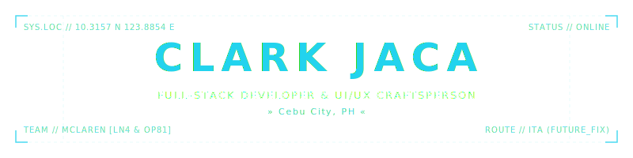

<!--
┌────────────────────────────────────────────────────────┐
│  CLARK JACA // GITHUB PROFILE README                  │
│  DESIGN SYSTEM: CYBER-HUD v4 (DARK / CYAN ACCENTS)     │
│  PORTFOLIO: https://www.clarkjaca.com                  │
└────────────────────────────────────────────────────────┘
-->

<p align="center">
  
</p>


I build software end to end — web platforms, mobile apps, desktop tools, and the back ends that hold them up. Motion and typography are the finish; the system underneath is the work.


#### TECH STACK / ECOSYSTEM
<p align="left">
  
</p>


<p align="center">
  <a href="https://github.com/clark2405">
    <picture>
      <source media="(prefers-color-scheme: dark)" srcset="https://github-readme-streak-stats.herokuapp.com/?user=clark2405&amp;theme=transparent&amp;ring=22d3ee&amp;fire=22d3ee&amp;currStreakNum=ffffff&amp;sideNums=ffffff&amp;sideLabels=a0aec0&amp;dates=22d3ee&amp;currStreakLabel=22d3ee&amp;border=22d3ee&amp;hide_border=false&amp;border_radius=0&amp;cb=20260529">
      <source media="(prefers-color-scheme: light)" srcset="https://github-readme-streak-stats.herokuapp.com/?user=clark2405&amp;theme=transparent&amp;ring=0891b2&amp;fire=0891b2&amp;currStreakNum=1e293b&amp;sideNums=1e293b&amp;sideLabels=475569&amp;dates=0891b2&amp;currStreakLabel=0891b2&amp;border=0891b2&amp;hide_border=false&amp;border_radius=0&amp;cb=20260529">
      
    </picture>
  </a>
</p>

#### CONTRIBUTION DYNAMICS

<p align="center">
  <a href="https://github.com/clark2405">
    <picture>
      <source media="(prefers-color-scheme: dark)" srcset="https://github-readme-activity-graph.vercel.app/graph?username=clark2405&amp;bg_color=transparent&amp;color=22d3ee&amp;line=22d3ee&amp;point=ffffff&amp;area=true&amp;area_color=22d3ee&amp;hide_border=true&amp;custom_title=CONTRIBUTION%20ACTIVITY%20GRAPH">
      <source media="(prefers-color-scheme: light)" srcset="https://github-readme-activity-graph.vercel.app/graph?username=clark2405&amp;bg_color=transparent&amp;color=0891b2&amp;line=0891b2&amp;point=0891b2&amp;area=true&amp;area_color=0891b2&amp;hide_border=true&amp;custom_title=CONTRIBUTION%20ACTIVITY%20GRAPH">
      
    </picture>
  </a>
</p>

---

### CONNECT / UPLINK

*   **Website:** [clarkjaca.com](https://www.clarkjaca.com)
*   **LinkedIn:** [linkedin.com/in/clarkjaca](https://linkedin.com)
*   **Email:** [clarkjaca@gmail.com](mailto:clarkjaca@gmail.com)

```
└─ SYSTEM UPLINK TERMINATED // [BYE]
```
